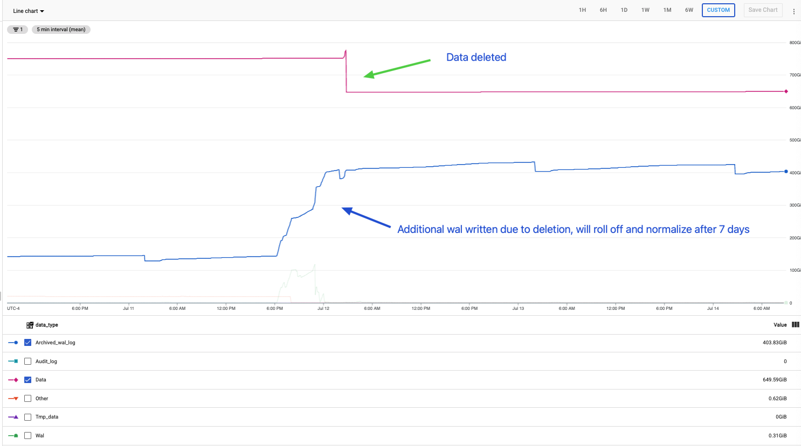

[Playbooks](../../../../README.md) > [Data](../../../README.md) > 
[Databases](../../README.md) > [PostgreSQL](../../README.md) > 
[Excessive storage](../../general/common-problems/pb_storage_excessive.md) >
Cloud SQL Archived_wal_log

# Archived_wal_log excessive space usage

This playbook is meant to help troubleshoot when Archived_wal_log is using excessive disk space

## Summary

A large data manipulation operation against an instance with Point-in-Time Recovery(PITR) enabled is usually the cause for Archived_wal_log taking up a lot of space.   

Because PITR is often needed to meet business requirements (RPO/RTO), resolution steps should be carefully considered and the implications clearly conveyed to the customer.    
**This means there could be data loss in the event of a failure if PITR is disabled or settings are changed.**

## Actions
Please follow the Checklist and linked sections afterward for more details.

### Checklist
- [ ] Confirm PITR is enabled
- [ ] Confirm automatic storage increase is enabled
- [ ] [Find the culprit](#find-the-culprit-and-gather-more-info-from-the-customer)
  - [ ] LOAD/INSERT
  - [ ] UPDATE
  - [ ] DELETE
- [ ] [Recurring or one-off?](#find-the-culprit-and-gather-more-info-from-the-customer)
  - [ ] Recurring
  - [ ] one-off
- [ ] Resolve
  - [ ] [Wait it out](#wait-it-out-recommenced)
  - [ ] [Disable PITR](#disable-pitr)
  - [ ] [Reduce PITR log retention](#reduce-the-pitr-log-retention)

### Find the culprit and gather more info from the customer

As mentioned, usually a large DML operation will cause this issue.   
- If it was a large data load, there will be a correlated increase in Data space used as well.
- If it was a large delete, [there will be a correlated decrease in Data space used](#large-delete-operation). 
- If it was an update, there will be no significant change in data space. 
After analyzing space used metrics for any anomalies, discuss this with the customer.
- Confirm your findings with them
- Find out if the culprit process will be recurring

### Resolutions

#### Wait it out (recommended)
The Archived_wal_log space will eventually be freed when the current PITR retention period is reached relative to the date/time the data manipulation was performed.    
Just keep in mind:    
> Logs are purged once daily, not continuously. Setting log retention to two days means that at least two days of logs, and at most three days of logs, are retained. We recommend setting the number of backups to one more than the days of log retention to guarantee a minimum of specified days of log retention.    

If the process that caused the excessive logging will be recurring, this is really the only option. The latter options would just be a band-aid.    
If automatic storage increase is not already enabled, [it probably should be](https://cloud.google.com/sql/docs/postgres/instance-settings#automatic-storage-increase-2ndgen) in order to prevent downtime.

#### Reduce the PITR log retention    
PITR log retention can be [adjusted to between 1 and 7(default) days](https://cloud.google.com/sql/docs/postgres/backup-recovery/pitr#set-retention). If the customer understands the implications, this can be reduced to free up space sooner.
If retention is reduced, space will free up relative to the date/time of the incident and retention period, keeping in mind the once per day log purge.    

#### Disable PITR    
[PITR can be disabled](https://cloud.google.com/sql/docs/postgres/backup-recovery/pitr#disablingpitr) (not recommended in Production systems).    
**WARNING**: If this is a production system, this must be carefully considered as the customer will not be able to perform a point in time restore.    
This is a business decision of risk vs reward.    
PITR can be enabled again once Archived_wal_log space is back to normal.

## Appendix A - Images

### Large Delete Operation
- 