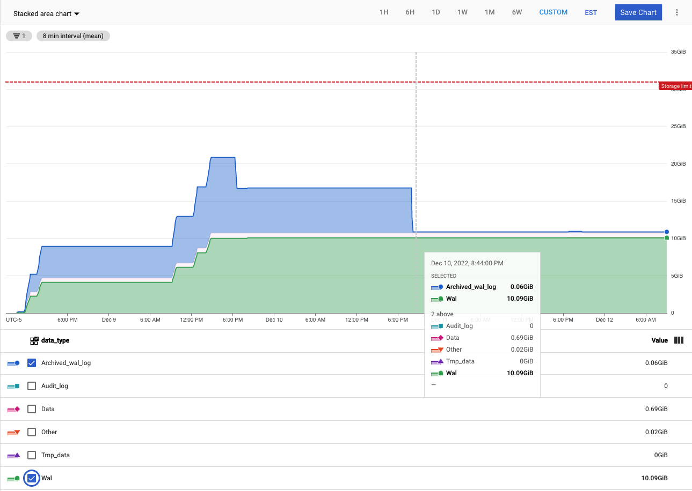

[Playbooks](../../../../README.md) > [Data](../../../README.md) > 
[Databases](../../README.md) > [PostgreSQL](../../README.md) > 
[Excessive storage](../../general/common-problems/pb_storage_excessive.md) >
Cloud SQL Wal

# Wal excessive space usage

This playbook is meant to help troubleshoot when Wal is using excessive disk space

## Summary

WAL files are retained until they are archived (into archived wal files) and are removed when they are no longer needed.   
Typically, when you see this issue you will see Wal space increase linearly, and it is typically due to orphaned or problematic replication slots.   
Here is [an example image of the problem](../images/cloud_monitoring_wal.jpg).     
Notice Archived_wal_log eventually rolls off, yet Wal consumption remains high.

## Actions
Please follow the Checklist and linked sections afterward for more details.   

### Checklist
- [ ] Confirm the version of Postgres
- [ ] Confirm PITR is enabled
- [ ] Confirm database flag [`cloudsql.logical_decoding` is set to](https://cloud.google.com/sql/docs/postgres/replication/configure-logical-replication#configuring-your-postgresql-instance) `on`
- [ ] Confirm if automatic storage increase is enabled (can prevent downtime if they are close to exhausting space)
- [ ] [Find the culprit](#find-the-culprit-and-gather-more-info-from-the-customer)
  - [ ] Orphaned replication slot
  - [ ] Replication lag (active slot)
- [ ] [Resolve](#resolutions)
  - [ ] Orphaned replication slot
    - [ ] Is the problematic slot necessary?
      - [ ] [Delete the slot](#delete-the-slot)
      - [ ] [Fix the slot](#fix-the-slot)
  - [ ] [Replication lag (active slot)](../../general/replication/pb_replication_lag.md)

### Find the culprit and gather more info from the customer

#### Orphaned replication slot

As mentioned, usually this will be caused by an orphaned or problematic replication slot.    
- Ask the customer if they currently have replication running, and can share the output of the following query:    

PostgreSQL v9: 
```
SELECT slot_name, pg_size_pretty(pg_xlog_location_diff(pg_current_xlog_location(),restart_lsn)) AS 
replicationSlotLag, active FROM pg_replication_slots ;
```
PostgreSQL v10 and later:
```
SELECT slot_name, pg_size_pretty(pg_wal_lsn_diff(pg_current_wal_lsn(),restart_lsn)) AS replicationSlotLag, 
active FROM pg_replication_slots ;
```

In the output, it should be clear which replication slot is the culprit. Look for a slot with a very large slot lag and `active = f`.    
Example:
```
 slot_name | replicationslotlag | active
-----------+--------------------+--------
 my_orphan | 4182 MB            | f
```

Generally, the problematic slot wasn't properly cleaned up by the process that created it; and it is no longer needed.    
This will need to be confirmed with the customer.

#### Replication lag

If the previous query comes back with `active = 't'` and a high slot lag, then it means the replica is active but having problems keeping up.   
In this case, move on to the [Replication lag playbook](../../general/replication/pb_replication_lag.md).

### Resolutions

#### Delete the slot
If the slot can be safely be dropped, then simply run `SELECT pg_drop_replication_slot('my_orphan');`, updating the slot name to match the customer environment.      
Wal space should be returned to normal shortly after this. 

#### Fix the slot    
If the slot is necessary, then the customer will have to fix it. Fixing the slot is beyond the scope of this article but will generally look like:    
1. Delete and recreate the slot, restart the subscriber        
**or** 
2. Fix the application which stopped reading from the slot    

#### Replication lag (active slot)
Move on to the [Replication lag playbook](../../general/replication/pb_replication_lag.md).    

## Appendix A - Images

### Problematic replication slot
- 
